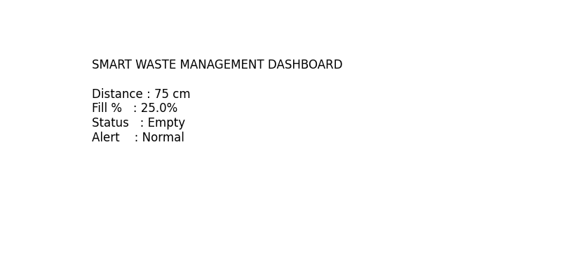
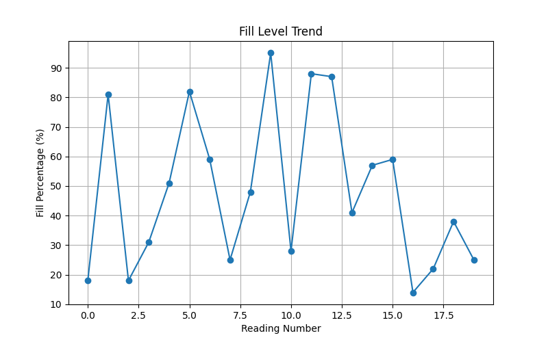
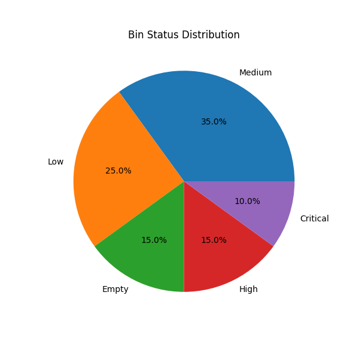
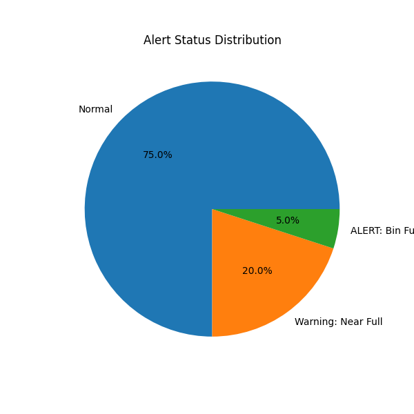

# Smart Waste Management Bin Level Detection System

## Overview

The Smart Waste Management Bin Level Detection System is an IoT-based solution designed to monitor waste bin fill levels and improve waste collection efficiency. The system simulates sensor-based monitoring using Arduino and Python, generates real-time waste level data, detects critical fill conditions, produces alerts, and visualizes waste management insights through charts and dashboards.

---

## Objective

To develop a smart waste monitoring system that tracks bin fill levels, identifies bins requiring immediate attention, and provides visual analytics to support efficient waste collection and smart city initiatives.

---

## Key Features

* Real-time waste bin level monitoring simulation
* Fill percentage calculation
* Bin status classification
* Alert generation for high fill levels
* Waste data storage in CSV format
* Trend analysis through graphical visualizations
* Dashboard generation for monitoring insights
* Automated report visualization

---

## Technologies Used

* Python
* Arduino IDE
* Pandas
* Matplotlib
* CSV Data Handling

---

## Project Structure

```text
Smart-Waste-Management-Bin-Level-Detection-System/

│
├── arduino_code/
│   └── smart_waste_monitor.ino
│
├── python_simulation/
│   ├── data_generator.py
│   ├── fill_level_calculator.py
│   ├── alert_system.py
│   └── report_generator.py
│
├── data/
│   └── waste_data.csv
│
├── images/
│   ├── dashboard_output.png
│   ├── fill_level_trend_chart.png
│   ├── bin_status_distribution.png
│   └── alert_status_chart.png
│
├── .gitignore
├── README.md
├── requirements.txt
└── main.py
```

---

## System Workflow

```text
Waste Level Detection
          ↓
Data Generation
          ↓
Fill Percentage Calculation
          ↓
Status Classification
          ↓
Alert Detection
          ↓
CSV Data Storage
          ↓
Visualization & Dashboard Generation
```

---

## Bin Status Categories

| Fill Percentage | Status   |
| --------------- | -------- |
| 0% - 49%        | Low      |
| 50% - 74%       | Medium   |
| 75% - 89%       | High     |
| 90% - 100%      | Critical |

---

## Alert Conditions

| Fill Percentage | Alert   |
| --------------- | ------- |
| Below 75%       | Normal  |
| 75% - 89%       | Warning |
| 90% and Above   | Full    |

---

## Generated Outputs

### Waste Data File

```text
data/waste_data.csv
```

Stores generated waste monitoring records including:

* Timestamp
* Distance from sensor
* Fill Percentage
* Bin Status
* Alert Status

---

## Visualization Outputs

### Dashboard Output

Provides a summary of the latest waste bin condition.



---

### Fill Level Trend Chart

Displays waste fill percentage variation across readings.



---

### Bin Status Distribution

Shows the percentage distribution of Low, Medium, High, and Critical bin states.



---

### Alert Status Distribution

Visualizes Normal, Warning, and Full alert occurrences.



---

## Installation

Install required Python libraries:

```bash
pip install pandas matplotlib
```

Or install from requirements file:

```bash
pip install -r requirements.txt
```

---

## Execution

Run the project using:

```bash
python main.py
```

---

## Sample Output

```text
2026-06-12 15:10:20 12 88 High Warning
2026-06-12 15:10:25 5 95 Critical Full
2026-06-12 15:10:30 28 72 Medium Normal
```

---

## Applications

* Smart Cities
* Municipal Waste Management
* Public Infrastructure Monitoring
* Environmental Sustainability Projects
* IoT-Based Monitoring Systems
* Automated Waste Collection Planning

---

## Future Enhancements

* Integration with Ultrasonic Sensors
* Cloud-Based Data Storage
* IoT Dashboard using MQTT
* Mobile Application Integration
* Real-Time Notifications
* GPS-Based Waste Collection Optimization

---

## Conclusion

This project demonstrates how IoT and data analytics can be combined to improve waste management operations through intelligent monitoring, automated alerts, and visual insights. The system provides a scalable foundation for developing smart city waste management solutions and promoting sustainable urban infrastructure.

---

## Author 

~Ananya Jain
---
